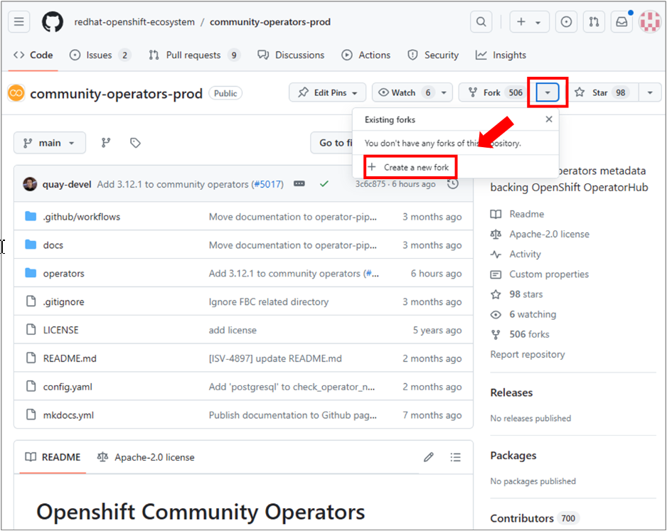
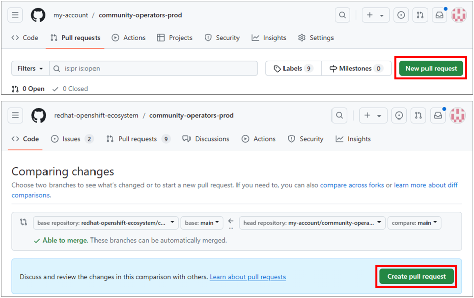
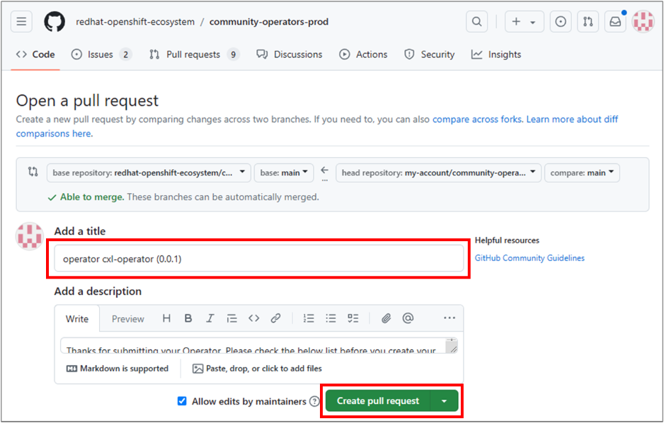
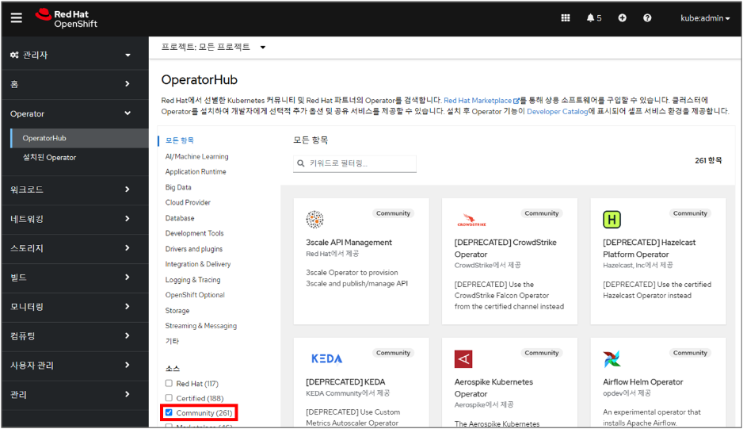

# Samsung CMM-D Operator의 Build 및 Deploy 가이드
개발된 Samsung CMM-D Operator를 사용자가 OLM Web Console에서 편리하게 사용하기위해 OLM의 Community 카탈로그에 Build 및 Deploy 하는 방법에 대해 기술 합니다.   
<br>

## Build and Deploy
<br>

### Operator Build and Push
Operator를 Build 하고 Push 하기위해 아래와 같은 명령을 실행 합니다.   


```bash
$> make docker-build docker-push IMG=<registry>/<user>/<image_name>:<tag>
```   


### Bundle
- OLM 환경에서 Operator 를 사용하기 위해 Operator 이미지 빌드 외에도 Bundle 형식의  작성이 필요 합니다.
- Bundle 은 Operator 설치를 위한 Manifest 와 Metadata 로 구성되어 있습니다.
- 작성한 Bundle 을 Redhat Openshift Ecosystem 의 카탈로그 소스 Git Repository 에 Merge 하면, OperatorHub 의 Community 카탈로그 소스 Operator 목록에 반영 됩니다.   


> Generate Manifest   
> 
> ```bash
> $> make bundle
> $> tree bundle
> bundle
> ├── manifests
> │   ├── cxl.antline.com_cxls.yaml
> │   ├── cxl-operator.clusterserviceversion.yaml
> │   └── ... 
> ├── metadata
> │   └── annotations.yaml
> └── tests
>     └── ...
> ```

<br>

### Fork Git Repository
Redhat Openshift Ecosystem 의 Github Repository 중 [community-operators-prod.git](https://github.com/redhat-openshift-ecosystem/community-operators-prod.git) 을 Fork 합니다.   
<br>
   
   
<br>

```bash
$> tree
community-operators-prod
├── docs
│   └── ...
└── operators
     ├── some-other-operator
     │   ├── 0.0.1
     │   └── ...
     ├── ...

```   
<br>
Operator/<Operator 명>/<version> 의 경로에 Bundle을 복사합니다.   

```bash	
$> tree
community-operators-prod

├── docs
│   └── ...
└── operators
     ├── cxl-operator
     │   └── 0.0.1
     │        ├── manifests
     │        │   ├── cxl.antline.com_cxls.yaml
     │        │   ├── cxl-operator.clusterserviceversion.yaml
     │        │   └── ... 
     │        ├── metadata
     │        │   └── annotations.yaml
     │        └── tests
     │             └── ...
     ├── some-other-operator
     │   ├── 0.0.1
     │   └── ...
     ├── ...

```   

<br>

### Merge


1. Fork 한 계정의 Repository에서 Pull Request를 생성 합니다.

   

<br>

> - Pull Request 이후에 Redhat Operator Communiy 에서 Pull Request 한 Bundle에 대해 체크 및 확인 절차를 진행 합니다.   
>    

2. Title은 Operator<operator 명>(<versionA>) 형식으로 작성 합니다.   

   

<br>

3. Pull Request 생성 후 Validation 이 진행되고 Merge 가 완료 되면, 일정시간 후 OperatorHub 의 Community 카탈로그 소스 Operator 목록에 반영 됩니다.   

   

<br>

