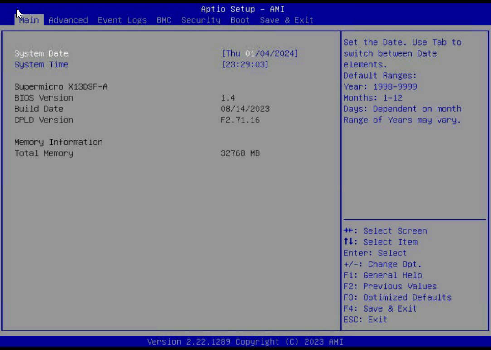
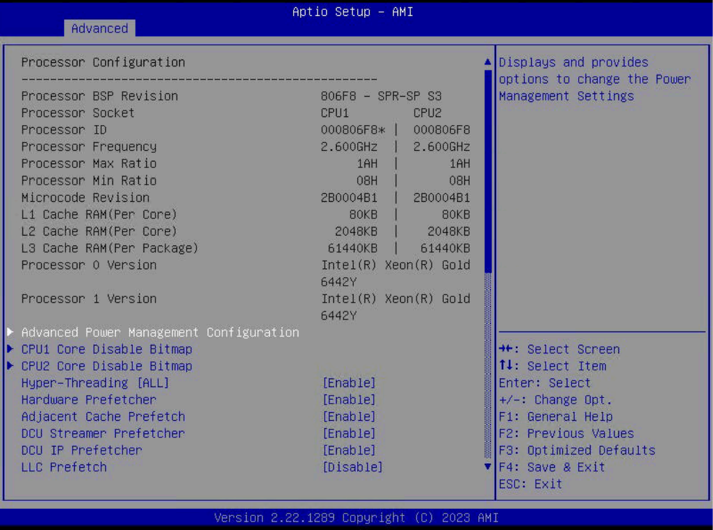
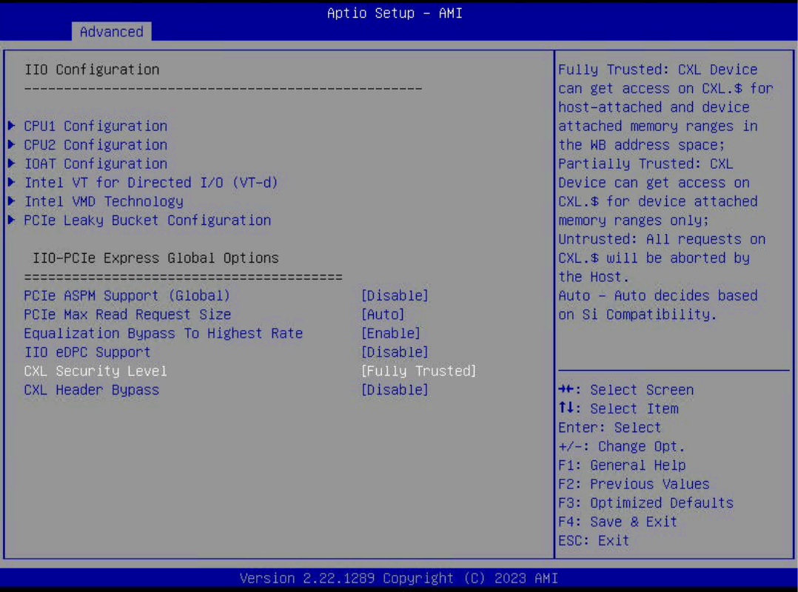
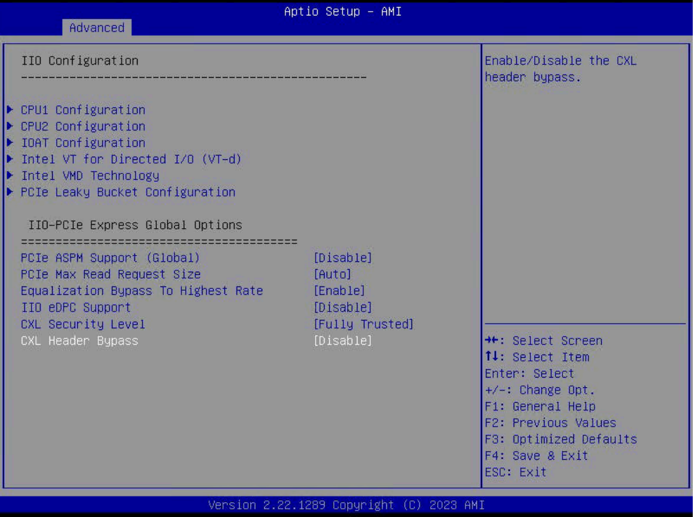
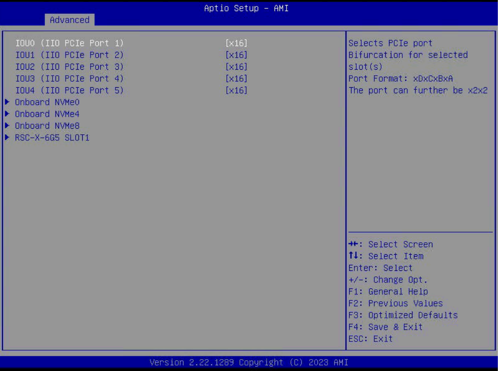
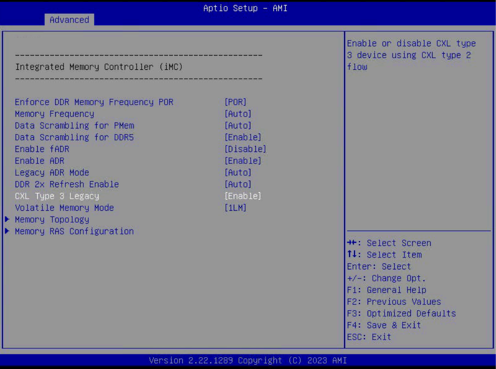
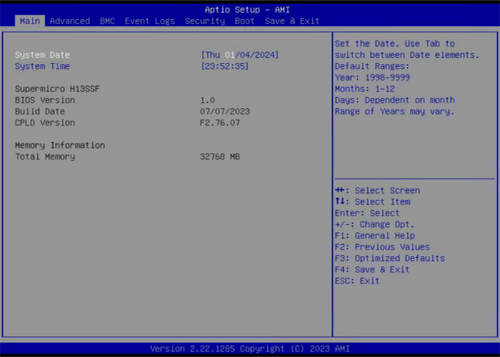
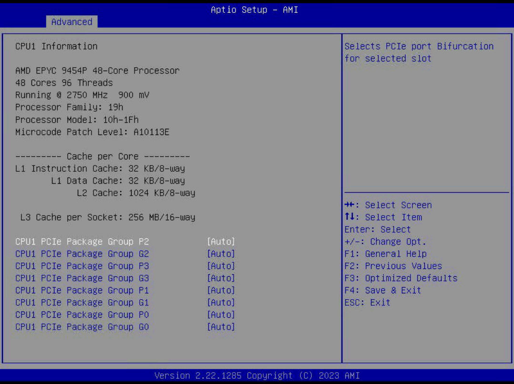

# System requirments
Samsung CMM-D for Oprerator를 안정적으로 사용하기 위한 System, BIOS requirement 를 설명 합니다.   
현재 CXL Extend Memory를 지원하는 Supermicro Server를 대상으로 테스트 진행 및 검증 되었습니다.   
   

아래 표들은 현재 Samsung CMM-D를 지원하는 Baremetal Host, x86 CPU, 및 BIOS Version 및 OS (Linux) Version을   
보여줍니다. 또한 x86 CPU인 AMD, INTEL 환경의 BIOS 구성을 설명합니다.

### Supported baremetal Host Information
|TYPE|OS Ver|Server Model|BIOS rev|CPU|Memory|Disk|
|-----|----------|-----|-----|---------|----------|-----------|
|AMD|RHEL 9.3|Supermicro Super Server   ( Base Board : H13SSF )|07/07/2023|48 core   1 Socket|32 GB   (1 NUMA)|894.3 GB|
|INTEL|RHEL 9.3|Supermicro   SSG-121E-NE316R   ( Base Board : X13DSF-A )|08/14/2023|24 core   1 Socket|32 GB   (1 NUMA)|894.3 GB|

<br>   

### CPU Model Information
| TYPE 	| CPU Model 	| OEM Strings 	|
|---	|---	|---	|
| AMD 	| AMD EPYC 9454P 48-Core Processor 	| AMD EPYC Soc/Genoa Supermicro Motherboard-H13 Series 	|
| INTEL 	| Intel(R) Xeon(R) Gold 6442Y 	| Intel Sapphire Rapids/Emmitsburg/EagleStream Supermicro motherboard-X13   Series 	|   
   
<br>   

### Samsung CXL Expander Information
| TYPE 	| CXL Expander Model 	|
|---	|---	|
| AMD 	| CXL: Montage Technology Co., Ltd. Device c000 |
| INTEL 	| CXL: Montage Technology Co., Ltd. Device c000&nbsp;&nbsp;&nbsp;&nbsp;&nbsp;&nbsp;&nbsp;&nbsp;&nbsp;&nbsp;&nbsp;&nbsp;&nbsp;&nbsp;&nbsp;&nbsp;&nbsp;&nbsp;&nbsp;&nbsp;&nbsp;&nbsp;&nbsp;&nbsp;&nbsp;&nbsp;&nbsp;&nbsp;&nbsp;&nbsp;&nbsp;&nbsp;&nbsp;&nbsp;&nbsp;&nbsp;&nbsp;&nbsp;&nbsp;&nbsp;&nbsp;&nbsp;&nbsp;&nbsp;&nbsp;&nbsp;&nbsp;&nbsp;&nbsp;&nbsp;&nbsp;&nbsp;&nbsp;&nbsp;&nbsp;&nbsp;&nbsp;&nbsp;&nbsp;&nbsp;&nbsp;&nbsp;&nbsp;&nbsp;&nbsp;&nbsp;&nbsp;&nbsp;&nbsp;&nbsp;&nbsp;&nbsp;&nbsp;&nbsp;&nbsp;&nbsp;&nbsp;&nbsp;&nbsp;&nbsp;&nbsp;&nbsp;&nbsp;&nbsp;&nbsp;&nbsp;&nbsp;&nbsp;&nbsp;&nbsp;&nbsp;&nbsp;&nbsp;&nbsp;&nbsp;&nbsp;&nbsp;&nbsp;&nbsp;&nbsp;|   

<br>   

### CXL Operating System (Linux) 호환성
Samsung CXL Expander (1.1) Memory 는 INTEL, AMD CPU 환경에서 인식이 가능하며, OSKernel 의 CXL 지원여부를   
사전에 파악해야 합니다. 아래는 검증을 위한 OS 지원표 입니다.   
<table>
        <tr>
            <th scope="col">TYPE</th>
            <th scope="col">BIOS Mode</th>
            <th scope="col">Linux Version</th>
        </tr>
        <tr>
            <td rowspan="4">AMD</td>
            <td rowspan="2">SPM Disable <br> (System RAM Type)</td>
            <td>Red Hat Enterprise Linux 9.2 이상<br>( Kernel : 5.14.0-284 )</td>
        </tr>
        <tr>
            <td><b>* Fedora 37, 38</b> 등 대부분의 <b>O/S</b>에서 메모리 인식</td>
        </tr>
        <tr>
            <td rowspan="2">SPM Disable <br> ((DAX HotPlug Type)</td>
            <td>Red Hat Enterprise Linux 9.2 이상<br>( Kernel : 5.14.0-284 )</td>
        </tr>
        <tr>
            <td>Fedora 37 이상<br>( Kernel : kernel-6.5.8-100 )</td>
        </tr>
        <tr>
            <td rowspan="3">INTEL</td>
            <td>SPM Disable <br> (System RAM Type)</td>
            <td style="color:red"><b>BIOS NOT Support</b></td>
        </tr>
        <tr>
            <td rowspan="2">SPM Disable <br> ((DAX HotPlug Type)</td>
            <td>Red Hat Enterprise Linux 9.2 이상<br>( Kernel : 5.14.0-284 )</td>
        </tr>
        <tr>
            <td>Fedora 37 이상<br>( Kernel : kernel-6.5.8-100 )</td>
        </tr>        
</table>
<br>

## INTEL BIOS Version rquierment
CXL Memory Expander 를 지원하는 INTEL CPU 아키텍처의 경우 아래의 환경을 충족해야 합니다.   
```yaml
➔ Vendor : American Megatrends International, LLC.
➔ System Product Name : SSG-121E-NE316R
➔ Board Product Name : X13DSF-A (1.01)
➔ BIOS Version : 1.4 ( Revision : 5.31 )
➔ Build Date : 08/14/2023
➔ CPLD Version : F2.71.16 
```

CXL Memory Expander를 지원하는 INTEL BIOS의 경우 Total Memory에 CXL Memory Expander 용량이   
포함되는 경우가 있고 아닌 경우가 있습니다. 현재 활용가이드의 BIOS 환경에서는 CXL Memory Expander 용량을   
포함하지 않은 Local Memory 용량만 보여 주고 있습니다.   


   
<br>

### INTEL CPU Information
INTEL Sapphire Rapids CPU 는 PCIe5.0 및 CXL(Compute Express Link) 1.1 상호 연결로 증가된   
I/O 환경을 제공합니다.
```yaml
➔ CPU Model Name : Intel(R) Xeon(R) Gold 6442Y
➔ ( INTEL Sapphire Rapids/Emmitsburg/EagleStream )
➔ Supermicro motherboard-X13 Series
```
   


<br>

### INTEL BIOS Configueration
완전 신뢰모드(Fully Trusted) 로 설정하여 CXL 장치에 대한 보안수준을 설정합니다.   
<b>➔ Advanced Menu ➔ Chipset Configuration ➔ North Bridge ➔ IIO Configuration ➔    
CXL Security Level :<span style='background-color: yellow; color: red;'>[ Fully Trusted ]</span></b>
<br>


<br>

CXL Header 우회를 비활성화 합니다.   
   
<b>➔ Advanced Menu ➔ Chipset Configuration ➔ North Bridge ➔ IIO Configuration ➔    
CXL Header bypass :<span style='background-color: yellow; color: red;'>[ Disable ]</span></b>
<br>


<br>

CPU0 에 대한 PCIe 포트의 분기 설정을 구성합니다.   
   
<b>➔ Advanced Menu ➔ Chipset Configuration ➔ North Bridge ➔ IIO Configuration ➔    
CPU0 Configuration ➔ IOU3 (IIO PCIe Port 3) : <span style='background-color: yellow; color: red;'>[ x16 ]</span></b>
<br>


<br>

CPU1 에 대한 PCIe 포트의 분기 설정을 구성합니다.   
   
<b>➔ Advanced Menu ➔ Chipset Configuration ➔ North Bridge ➔ IIO Configuration ➔    
CPU0 Configuration ➔ IOU3 (IIO PCIe Port 3) : <span style='background-color: yellow; color: red;'>[ x16 ]</span></b>
<br>


<br>

CXL Type 3 장치에 대한 레거시 지원을 활성화합니다.  
   
<b>➔ Advanced Menu ➔ NB Configuration ➔ Memory Configuration ➔ CXL Type3 legacy : <span style='background-color: yellow; color: red;'>[ Enable ]</span></b>
<br>


<br>

CXL EFI_MEMORY_SP 에 대한 설정을 진행합니다. <b>( Default : Enabled )</b>   
```yaml
➔ 이 설정은 CXL 메모리를 특수 목적 메모리로 설정합니다. INTEL 아키텍처의 경우 Enabled 설정만 가능합니다.
➔ Enabled : DAX Mode 사용
➔ Disabled : Direct System Memory 사용 (Intel 사용 불가-MB 기능 제공 불가) 
```
   
<br>

## AMD BIOS Version rquierment
Samsung CMM-D를 지원하는 AMD 아키텍처의 경우 아래의 환경을 충족해야 합니다.   
```yaml
➔ Vendor : American Megatrends International, LLC.
➔ System Product Name : Super Server
➔ Board Product Name : H13SSF (1.01)
➔ BIOS Version : 1.0
➔ BIOS Revision : 5.27
➔ Build Date : 07/07/2023
➔ CPLD Version : F2.76.07 
```

CXL Memory Expander를 지원하는 AMD BIOS의 경우 Total Memory에 CXL Memory   
Expander 용량이 포함되는 경우가 있고 아닌 경우가 있습니다. 현재 활용가이드의 BIOS 환경에서는   
CXL Memory Expander 용량을 포함하지 않은 Local Memory 용량만 보여 주고 있습니다.   


   
<br>

### AMD CPU Information
AMD EPYC Genoa CPU 는 PCIe5.0 및 CXL(Compute Express Link) 1.1 상호 연결로 증가된 I/O   
환경을 제공합니다.
```yaml
➔ CPU Model Name : AMD EPYC 9454P 48-Core Processor
( AMD EPYC Soc/Genoa )
➔ Supermicro Motherboard-H13 Series
```
   

   
<br>

### AMD CXL SPM Mode
이 설정은 CXL 메모리를 특수 목적 메모리로 설정합니다. 활성화/비활성에의 차이는 아래와 같습니다.   
   
<b>➔ Advanced Menu ➔ NB Configuration ➔ CXL SPM : <span style='background-color: yellow; color: red;'>[ Enabled ]</span></b>   
<b>➔ Enabled : DAX Mode 사용 (OS 레벨에서 CXL Expander를 목적에 맞게 활성화 후 사용)</b>   
<b>➔ Disabled : Direct System Memory 사용 (BIOS 레벨에서 CXL Expander를 사전 활성화 후 OS 에서 Local memory 인식 후 사용)</b>   
<br>   
   

