# Samsung CMM-D for Operator Test Environment
<br>

## Hardware Configuration
|Node|H/W|Usage|CPU|Local Memory|CXL|etc|
|-----|----------|-----|-----|---------|----------|-----------|
|node #1|Dell|KVM|Intel <br> 96 Core|512 GB|NA|&nbsp;&nbsp;&nbsp;&nbsp;&nbsp;&nbsp;&nbsp;&nbsp;&nbsp;&nbsp;|
|node #2 / <br> cmmd1|SMC|OCP Worker #1|Intel <br> 96 Core|64 GB|512 GB <br> 128 GB * 4ea|&nbsp;&nbsp;&nbsp;&nbsp;&nbsp;&nbsp;&nbsp;&nbsp;&nbsp;&nbsp;|
 node #3 / <br> cmmd2|SMC|OCP Worker #2|AMD <br> 96 Core|128 GB|512 GB <br> 128 GB * 4ea|&nbsp;&nbsp;&nbsp;&nbsp;&nbsp;&nbsp;&nbsp;&nbsp;&nbsp;&nbsp;|
 node #4 / <br> cmmd3|SMC|OCP Worker #3|AMD <br> 96 Core|64 GB|512 GB <br> 128 GB * 4ea|&nbsp;&nbsp;&nbsp;&nbsp;&nbsp;&nbsp;&nbsp;&nbsp;&nbsp;&nbsp;|
   
<br>   

## Software Configuration
 Software version information is as follows:

```bash
$ oc version
Client Version: 4.14.16
Kustomize Version: v5.0.1
Server Version: 4.14.16
Kubernetes Version: v1.27.10+c79e5e2

$ oc debug node/cmmd1
sh-4.4# chroot /host
sh-5.1# grep -e "OPENSHIFT_VERSION" -e "RHEL_VERSION" -e "^VERSION=" /etc/os-release
VERSION="414.92.202403051622-0"
OPENSHIFT_VERSION="4.14"
RHEL_VERSION="9.2"
```
<br>
   

## Test Scenario Target Node Information
 Information about the target node for the End-to-End (E2E) test scenario is as follows:   


 <br>


## How to Test Operator Functions
This is an explanation of how to use the Samsung CMM-D Operator.  
<br>
   
1. Openshift Cluster Installation
- To test the CMM-D Operator, an OpenShift Cluster must be installed in a server environment where CMM-D is configured, as described in the hardware and software environment above.
  For detailed installation instructions, please refer to the [Red Hat OpenShift installation guide](https://docs.redhat.com/ko/documentation/openshift_container_platform/4.9/html-single/installing/index).
  
2. Installing the Operator via the Red Hat Operator Hub Web Console   <br><br>
	1) Search for Operators in the Red Hat OCP Web Console   <br>  
	   The image below shows the first screen when accessing the Red Hat OCP Web Console.   

	   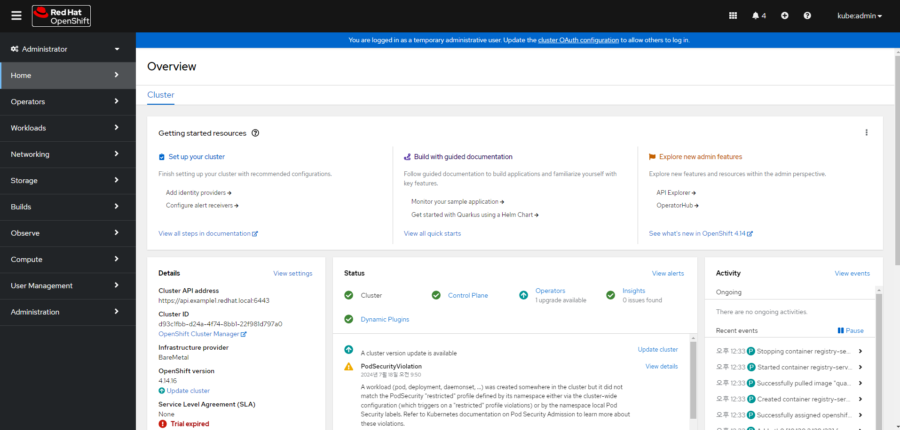   
	   <br>

	   The image below shows the screen that appears when you click the OperatorHub menu to search for an operator in the Red Hat OCP Web Console.   

	      
	   <br>

	   The image below shows the search screen for finding the Samsung CMM-D Operator. When you enter a search term, the matching operators will be displayed.   

	   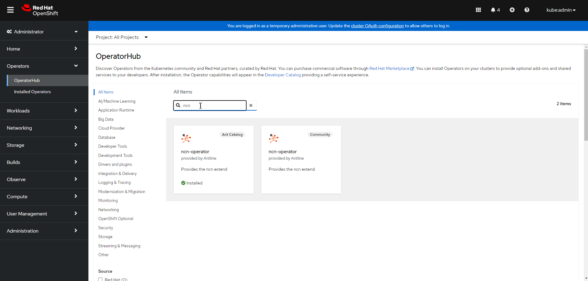   
	   <br>

	2) Select the Operator and Specify Installation Options   
	
	   The image below shows the installation screen that appears when you click on the operator found in step 1.
           After selecting the necessary installation options, click the 'Install' button to proceed.   

	   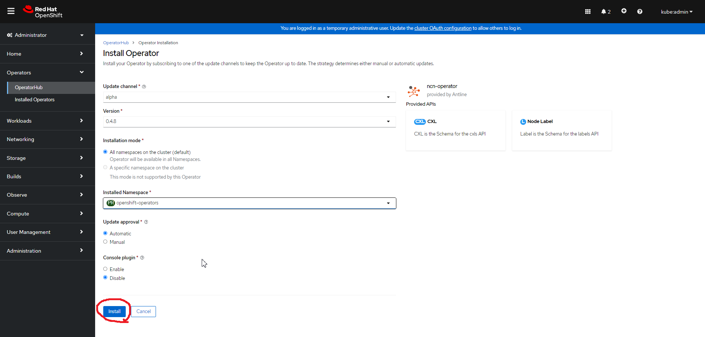   
	   <br>

	4) Operator Installation   
	
	   The image below shows the installation screen that appears when you click the 'Install' button, as shown in the previous image.   <br>

	   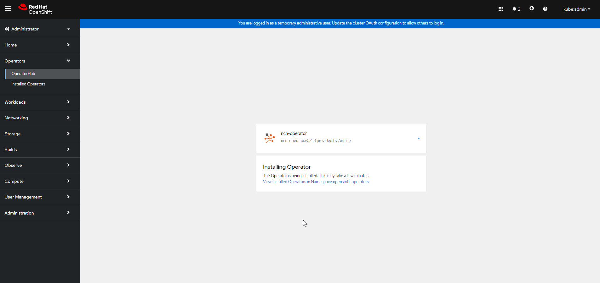   
	   <br>

	   The image below shows the screen displayed after the operator installation is completed.   

	   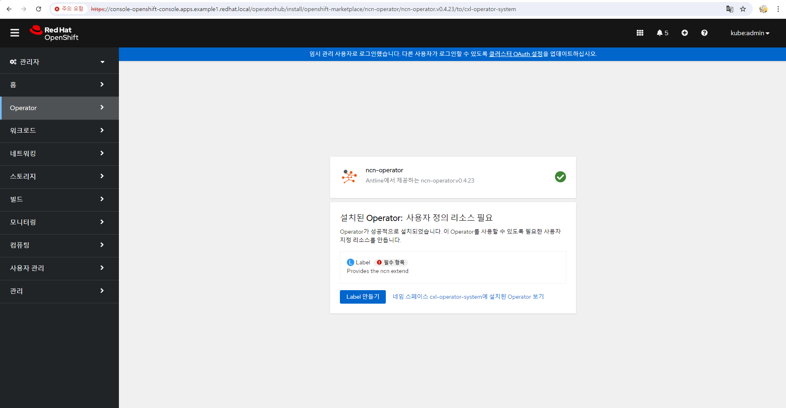   
	   <br><br>   

3. CRD (Custom Resource Definition)   
		- CRD is defined as follows. Based on this definition, submit a Custom Resource (CR).
		   
```yaml
apiVersion: apiextensions.k8s.io/v1					<1>
kind: CustomResourceDefinition						<2>   
metadata:
  annotations:
    controller-gen.kubebuilder.io/version: v0.11.1
  creationTimestamp: null
  name: cxls.cxl.antline.com
spec:
  group: cxl.antline.com
  names:
    kind: CXL
    listKind: CXLList
    plural: cxls
    singular: cxl
  scope: Namespaced
  versions:											<3>
  - name: v1										<4>
    schema:											<5>
    openAPIV3Schema:
      description: CXL is the Schema for the cxls API
      properties:
        apiVersion:
          description: 'APIVersion defines the versioned schema of this representation
            of an object. Servers should convert recognized schemas to the latest
            internal value, and may reject unrecognized values. More info: https://git.k8s.io/community/contributors/devel/sig-architecture/api-conventions.md#resources'
          type: string
        kind:
          description: 'Kind is a string value representing the REST resource this
            object represents. Servers may infer this from the endpoint the client
            submits requests to. Cannot be updated. In CamelCase. More info: https://git.k8s.io/community/contributors/devel/sig-architecture/api-conventions.md#types-kinds'
          type: string
        metadata:
          type: object

```		

   <b>&#10102; <span style="color:blue">&nbsp;&nbsp;&nbsp;&nbsp;&nbsp;&nbsp;&nbsp;&nbsp;Define the API version</span></b><br>
   <b>&#10103; <span style="color:blue">&nbsp;&nbsp;&nbsp;&nbsp;&nbsp;&nbsp;&nbsp;&nbsp;Defines the type of YAML document, specified as a Custom Resource Definition (CRD) document.</span></b><br>
   <b>&#10104;<span style="color:blue">&nbsp;&nbsp;&nbsp;&nbsp;&nbsp;&nbsp;&nbsp;&nbsp;Defines the list of versions supported by the CRD.</span></b><br>
   <b>&#10105; <span style="color:blue">&nbsp;&nbsp;&nbsp;&nbsp;&nbsp;&nbsp;&nbsp;&nbsp;Defines the name of the corresponding CRD version.</span></b><br>
   <b>&#10106;<span style="color:blue">&nbsp;&nbsp;&nbsp;&nbsp;&nbsp;&nbsp;&nbsp;&nbsp;Define the resource schema</span></b><br>
<br>   
   

```yaml
          spec:					<1>
            description: CXLSpec defines the desired state of CXL
            properties:			<2>
              allocate:			<3>
                description: Specify resource allocation manually
                properties:
                  cpu:			<4>
                    description: // +kubebuilder:validation:XIntOrString
                    type: string
                  memory:		<5>
                    description: //+kubebuilder:validation:XValidation:message="wrong
                      value type",rule="^([+-]?[0-9.]+)$"
                    type: string
                  nodeName:		<6>
                    type: string
                type: object
              allocateMode:		<7>
                description: Specify resource allocation mode
                enum:
                - auto
                - manual
                type: string
              enable:			<8>
                description: Whether use of CXL
                type: boolean
              payload:			<9>
                description: Specify user resource manifest. e.g.) Pod, Deployment,
                  Replicaset
                type: object
                x-kubernetes-embedded-resource: true
                x-kubernetes-preserve-unknown-fields: true
            required:			<10>
            - allocateMode
            - enable
            - payload
            type: object

```		

   <b>&#10102;<span style="color:blue">&nbsp;&nbsp;&nbsp;&nbsp;&nbsp;&nbsp;&nbsp;&nbsp;Define the specifications for the desired CXL</span></b><br>
   <b>&#10103;<span style="color:blue">&nbsp;&nbsp;&nbsp;&nbsp;&nbsp;&nbsp;&nbsp;&nbsp;Define the properties of the specification</span></b><br>
   <b>&#10104;<span style="color:blue">&nbsp;&nbsp;&nbsp;&nbsp;&nbsp;&nbsp;&nbsp;&nbsp;Defines properties for manually assigning resource allocations, including CPU, Memory, and nodeName.</span></b><br>
   <b>&#10105;<span style="color:blue">&nbsp;&nbsp;&nbsp;&nbsp;&nbsp;&nbsp;&nbsp;&nbsp;Specifies CPU resource allocation as a string type. (Set the cpuset.cpu value.)</span></b><br>
   <b>&#10106;<span style="color:blue">&nbsp;&nbsp;&nbsp;&nbsp;&nbsp;&nbsp;&nbsp;&nbsp;Specifies resource allocation for memory as a string type using numbers. (Set the cpuset.mems value.)</span></b><br>
   <b>&#10107;<span style="color:blue">&nbsp;&nbsp;&nbsp;&nbsp;&nbsp;&nbsp;&nbsp;&nbsp;Specify the name of the node to which resources will be allocated, in string format.</span></b><br>
   <b>&#10108;<span style="color:blue">&nbsp;&nbsp;&nbsp;&nbsp;&nbsp;&nbsp;&nbsp;&nbsp;Specify the resource allocation mode as either auto (automatic resource allocation) or manual (manual resource allocation).</span></b><br>
   <b>&#10109;<span style="color:blue">&nbsp;&nbsp;&nbsp;&nbsp;&nbsp;&nbsp;&nbsp;&nbsp;Defines whether to use CXL.</span></b><br>
   <b>&#10110;<span style="color:blue">&nbsp;&nbsp;&nbsp;&nbsp;&nbsp;&nbsp;&nbsp;&nbsp;Specifies the manifest for the Custom Resource (CR).</span></b><br>
   <b>&#10111;<span style="color:blue">&nbsp;&nbsp;&nbsp;&nbsp;&nbsp;&nbsp;&nbsp;&nbsp;Lists the required fields among the Spec properties. Here, allocateMode, enable, and payload are mandatory.</span></b><br>     	
<br>   

```yaml
          status:				<1>
            description: CXLStatus defines the observed state of CXL
            properties:			<2>
              allocateMode:
                type: string
              amountMemory:
                format: int64
                type: integer
              amountMemoryStr:
                type: string
              cpu:
                type: string
              enable:
                type: boolean
              kind:
                type: string
              memory:
                type: string
              name:
                type: string
              namespace:
                type: string
              nodeName:
                type: string
            type: object
        type: object
    served: true				<3>
    storage: true				<4>
    subresources:
      status: {}
status:
  acceptedNames:
    kind: ""
    plural: ""
  conditions: null
  storedVersions: null

```		  


   <b>&#10102;<span style="color:blue">&nbsp;&nbsp;&nbsp;&nbsp;&nbsp;&nbsp;&nbsp;&nbsp;Define the specifications for the desired CXL configuration.</span></b><br>
   <b>&#10103;<span style="color:blue">&nbsp;&nbsp;&nbsp;&nbsp;&nbsp;&nbsp;&nbsp;&nbsp;Define the properties of the specification.</span></b><br>
   <b>&#10104;<span style="color:blue">&nbsp;&nbsp;&nbsp;&nbsp;&nbsp;&nbsp;&nbsp;&nbsp;Defines properties for manually assigning resource allocations, including CPU, Memory, and nodeName.</span></b><br>
   <b>&#10105;<span style="color:blue">&nbsp;&nbsp;&nbsp;&nbsp;&nbsp;&nbsp;&nbsp;&nbsp;Specifies CPU resource allocation as a string. (Set the cpuset.cpu value.)</span></b><br>

<br>

## E2E Test
Prepare the environment for the E2E Test as described above. 
>- Build an environment that meets the specified hardware and software requirements.   
>- Openshift Cluster Installation   
>- Installing the Operator through the Web Console.   
>- Analysis of CRD (Custom Resource Definition)
<br>

After preparation, proceed with the test as follows.

<br>
   

### Test Scenario #1
Test whether the designated CPU and memory are well utilized by specifying CPU and memory NUMA in manual mode on nodes (cmd1, cmmd2, cmmd3) in the Samsung environment with CMM-D set.
  
<br>    

> 1. 실행 내용   

- 대상 노드 : cmmd1 (intel cpu node)
- allocationMode : manual
- memory : 2 (CXL Memory NUMA)
- cpu : 0-23 (cpu 0)
- 리소스 할당량 : 100 GB
- Pod 생성 및 삭제를 통한 리소스 회수   
<br>

> 2. CR (Custom Resource)   

```yaml
apiVersion: cxl.antline.com/v1
kind: CXL
metadata:
  name: scenario1001
  namespace: cxl-operator
spec:
  allocateMode: manual          <1>
  allocate:
    cpu: "0-23"             <2>
    memory: "2"             <3>
    nodeName: "cmmd1"         <4>
  enable: true              <5>
  payload:
    apiVersion: v1
    kind: Pod
    metadata:
      namespace: cxl-operator
      name: scenario1001
      labels:
        name: senario
    spec:
      terminationGracePeriodSeconds: 0
      containers:
      - name: stress
        image: quay.io/rasen708/stress:antline
        args: ["tail", "-f", "/dev/null"]
        resources:            <6>
          requests:
            memory: 100Gi
          limits:
            memory: 100Gi

```
   
   <b>&#10102;<span style="color:blue">&nbsp;&nbsp;&nbsp;&nbsp;&nbsp;&nbsp;&nbsp;&nbsp;Resource를 지정하는 mode에 대한 기술사항 입니다. (manual : Resource를 할당하는 mode, auto : 가장 효율적인 node를 선택 하여 자동으로 할당 하는 mode)</span></b><br>
   <b>&#10103;<span style="color:blue">&nbsp;&nbsp;&nbsp;&nbsp;&nbsp;&nbsp;&nbsp;&nbsp;manual mode 일때 지정될 CPU Core 정의</span></b><br>
   <b>&#10104;<span style="color:blue">&nbsp;&nbsp;&nbsp;&nbsp;&nbsp;&nbsp;&nbsp;&nbsp;manual mode 일때 지정될 Memory NUMA 정의</span></b><br>
   <b>&#10105;<span style="color:blue">&nbsp;&nbsp;&nbsp;&nbsp;&nbsp;&nbsp;&nbsp;&nbsp;생성할 Pod의 대상 node 이름 정의</span></b><br>
   <b>&#10106;<span style="color:blue">&nbsp;&nbsp;&nbsp;&nbsp;&nbsp;&nbsp;&nbsp;&nbsp;CXL Device 활용 여부 (true : 사용, false : 비 사용)</span></b><br>
   <b>&#10107;<span style="color:blue">&nbsp;&nbsp;&nbsp;&nbsp;&nbsp;&nbsp;&nbsp;&nbsp;요청/제한 Resource를 기술 합니다.</span></b><br>
<br>   

> 3. CR 제출 (Pod 생성)   
>   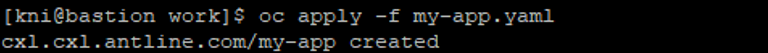   
>   
> 4. 생성된 Pod 확인   
> 
> ```bash
> [kni@bastion work]$ oc get pod
> ```  
>   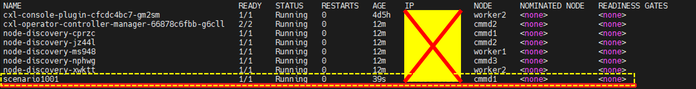      

  >> 할당된 memory resource 에 Stress Load 확인
  >> 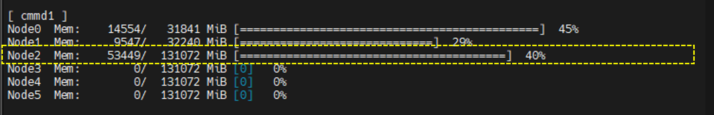   
  >> 
  >> 할당된 memory resource 에 Stress Load 확인
  >>    
  >> 
  >> 할당된 cpu resource 에 Stress Load 확인
  >> 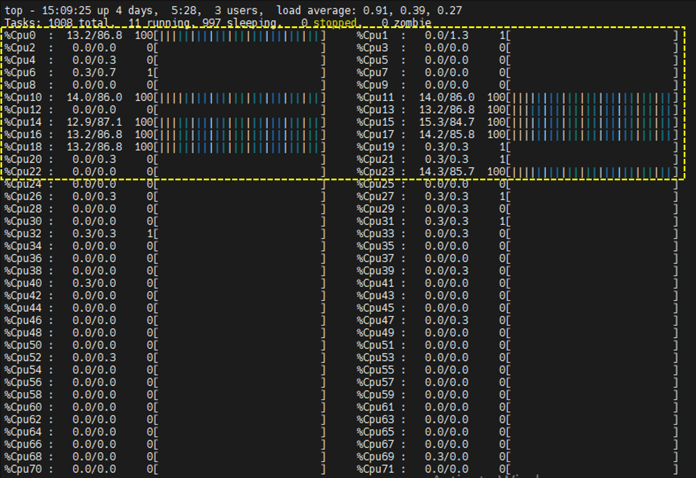   
<br>   


> 5. 생성된 Pod 삭제   
>   
>   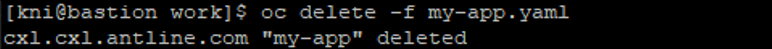   
<br>   

> 6. 삭제된 Pod 확인   
>   
>      
<br>   
   
   <br>
   <br>


### Test 시나리오 #2
CMM-D 가 세팅된 환경의 nodes (cmmd1, cmmd2, cmmd3) 중 cmmd2 node에 400GB 의 Pod가 할당되어 있는 상태에서 Auto mode로 200GB 의 Pod 생성요청을 제출 했을때, 3개 node 중 Pressure가 가장 적은 node에 자동으로 Pod가 생성 되는지 테스트 합니다.
  
<br>    

> 1. 사전 세팅 사항   

- 대상 노드 : cmmd2
- 권한 생성 : ServiceAccount 및 권한 생성 작업 진행
- 리소스 할당량 : cmmd2 node CMM-D에 400 GB Pod 할당
<br>

> 2. 실행 내용   

- 대상노드 : 모든 노드 (cmmd1, cmmd2, cmmd3)
- allocationMode : auto
- 리소스 할당량 : 200 GB
- Pod 생성 및 삭제를 통한 리소스 회수   
<br>

> 3. ServiceAccount 및 권한생성   

```yaml
---
apiVersion: rbac.authorization.k8s.io/v1
kind: ClusterRole
metadata:
  labels:
    app.kubernetes.io/component: stress01
    app.kubernetes.io/managed-by: cluster-monitoring-operator
    app.kubernetes.io/name: stress01
    app.kubernetes.io/part-of: stress01
  name: stress01
rules:
- apiGroups:
  - events.k8s.io
  - ""
  resources:
  - events
  verbs:
  - get
  - list
  - watch
  - create
  - update
- apiGroups:
  - operators.coreos.com
  resources:
  - clusterserviceversions
  - operators
  verbs:
  - get
  - list
  - watch
- apiGroups:
  - machineconfiguration.openshift.io
  resources:
  - machineconfigs
  verbs:
  - get
  - list
  - watch
- apiGroups:
  - security.openshift.io
  resources:
  - securitycontextconstraints
  verbs:
  - use
---
apiVersion: rbac.authorization.k8s.io/v1
kind: ClusterRoleBinding
metadata:
  labels:
    app: node-discovery
  name: stress01
roleRef:
  apiGroup: rbac.authorization.k8s.io
  kind: ClusterRole
  name: stress01
subjects:
- kind: ServiceAccount
  name: stress01
  namespace: cxl-operator
---
apiVersion: v1
kind: ServiceAccount
metadata:
  labels:
    app.kubernetes.io/component: stress01
    app.kubernetes.io/managed-by: cluster-monitoring-operator
    app.kubernetes.io/name: stress01
    app.kubernetes.io/part-of: stress01
  name: stress01
  namespace: cxl-operator

```   
<br>


> 4. cmmd2 서버 사전 할당 CR (Custom Resource)   

```yaml
apiVersion: cxl.antline.com/v1
kind: CXL
metadata:
  name: scenario-common
  namespace: cxl-operator
spec:
  allocateMode: manual              <1>
  allocate:
    nodeName: cmmd2                 <2>
    cpu: "auto"                     <3>  
    memory: "1"                     <4>
  enable: true
  payload:
    apiVersion: apps/v1
    kind: Deployment
    metadata:
      name: scenario-common
      namespace: cxl-operator
    spec:
      replicas: 1
      selector:
        matchLabels:
          name: scenario-common
      template:
        metadata: 
          labels:
            name: scenario-common
        spec:
          terminationGracePeriodSeconds: 0
          nodeSelector:
            node-role.kubernetes.io/cmmd: ""
          containers:
          - name: stress01
            image: quay.io/rasen708/stress:antline
            args: ["tail", "-f", "/dev/null"]
            resources:                <5>
              requests:
                memory: 400Gi     
              limits:
                memory: 400Gi     
          serviceAccount: stress01
          serviceAccountName: stress01


```
   
   <b>&#10102;<span style="color:blue">&nbsp;&nbsp;&nbsp;&nbsp;&nbsp;&nbsp;&nbsp;&nbsp;Resource를 지정하는 mode에 대한 기술사항 입니다. (manual : Resource를 할당하는 mode, auto : 가장 효율적인 node를 선택 하여 자동으로 할당 하는 mode)</span></b><br>
   <b>&#10103;<span style="color:blue">&nbsp;&nbsp;&nbsp;&nbsp;&nbsp;&nbsp;&nbsp;&nbsp;생성할 Pod의 대상 node 이름 정의</span></b><br>
   <b>&#10104;<span style="color:blue">&nbsp;&nbsp;&nbsp;&nbsp;&nbsp;&nbsp;&nbsp;&nbsp;manual mode 일때 지정될 CPU Core 정의 (자동할당)</span></b><br>
   <b>&#10105;<span style="color:blue">&nbsp;&nbsp;&nbsp;&nbsp;&nbsp;&nbsp;&nbsp;&nbsp;manual mode 일때 지정될 Memory NUMA 정의</span></b><br>
   <b>&#10106;<span style="color:blue">&nbsp;&nbsp;&nbsp;&nbsp;&nbsp;&nbsp;&nbsp;&nbsp;요청 및 제한할 Resource 정보를 기술합니다</span></b><br>
<br>   

> 5. Test CR (Custom Resource)   

```yaml
apiVersion: cxl.antline.com/v1
kind: CXL
metadata:
  name: scenario1003
  namespace: cxl-operator
spec:
  allocateMode: auto                  <1>
  enable: true                        <2>  
  payload:
    apiVersion: apps/v1
    kind: Deployment
    metadata:
      name: scenario1003
      namespace: cxl-operator
    spec:
      replicas: 1
      selector:
        matchLabels:
          name: scenario1003
      template:
        metadata: 
          labels:
            name: scenario1003
        spec:
          terminationGracePeriodSeconds: 0
          nodeSelector:
            node-role.kubernetes.io/cmmd: ""
          containers:
          - name: stress01
            image: quay.io/rasen708/stress:antline
            args: ["tail", "-f", "/dev/null"]
            resources:
              requests:
                memory: 200Gi
              limits:
                memory: 200Gi
          serviceAccount: stress01
          serviceAccountName: stress01

```
   
   <b>&#10102;<span style="color:blue">&nbsp;&nbsp;&nbsp;&nbsp;&nbsp;&nbsp;&nbsp;&nbsp;Resource를 지정하는 mode에 대한 기술사항 입니다. (manual : Resource를 할당하는 mode, auto : 가장 효율적인 node를 선택 하여 자동으로 할당 하는 mode)</span></b><br>
   <b>&#10103;<span style="color:blue">&nbsp;&nbsp;&nbsp;&nbsp;&nbsp;&nbsp;&nbsp;&nbsp;CXL 확장용 Memory 사용 여부를 기술합니다. (true:사용, false:사용하지 않음)</span></b><br>
<br>   


> 6. CR 제출 (Pod 생성)   
>> 시나리오 사전 pod 생성
>> ```bash
>> [kni@bastion work]$ oc apply -f pre-app.yaml pod
>> ```
>>    
>> 시나리오 pod 생성 
>> ```bash
>> [kni@bastion work]$ oc apply -f my-app.yaml pod
>> ```
>
> 7. 생성된 Pod (사전, Test) 확인   
> 
> ```bash
> [kni@bastion work]$ oc get pod
> ```  
>   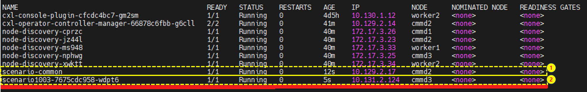      
>  <b>&#10102;&nbsp;&nbsp;&nbsp;&nbsp;&nbsp;&nbsp;&nbsp;&nbsp;테스트를 위해 사전에 생성된 Pod</b><br>
>  <b>&#10103;&nbsp;&nbsp;&nbsp;&nbsp;&nbsp;&nbsp;&nbsp;&nbsp;테스트를 위에 생성된 Pod</b><br>

><br>   

> 5. 생성된 Pod 삭제   
>   
> ```bash
> [kni@bastion work]$ oc delete -f pre-app.yaml pod
> ```   
>   

> 6. 삭제된 Pod 확인   
>   
>   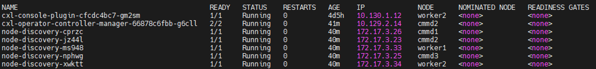   

<br>
<br>
### Test 시나리오 #3
CMM-D 가 세팅된 환경의 nodes (cmmd1, cmmd2, cmmd3)에 CMM-D 장치 리소스를 사용 하지 않고, 각  node의 Local Memory 중 가장 Pressure가 가장 적은 node에 50GB의 Pod가 생성 되는지 테스트 합니다.   

<br>    
   
> 1. 실행 내용   

- 대상 노드 : 모든 노드 (cmmd1, cmmd2, cmmd3)
- allocationMode : auto
- enable : false
- 리소스 할당량 : 50 GB

<br>

> 2. CR (Custom Resource)   

```yaml
apiVersion: cxl.antline.com/v1
kind: CXL
metadata:
  name: scenario1006
  namespace: cxl-operator
spec:
  allocateMode: auto              <1>
  enable: false                   <2>
  payload:
    apiVersion: apps/v1
    kind: Deployment
    metadata:
      name: scenario1006
      namespace: cxl-operator
    spec:
      replicas: 1
      selector:
        matchLabels:
          name: scenario1006
      template:
        metadata: 
          labels:
            name: scenario1006
        spec:
          terminationGracePeriodSeconds: 0
          nodeSelector:
            node-role.kubernetes.io/cmmd: ""
          containers:
          - name: stress01
            image: quay.io/rasen708/stress:antline
            args: ["tail", "-f", "/dev/null"]
            resources:
              requests:
                memory: 50Gi
              limits:
                memory: 50Gi
          serviceAccount: stress01
          serviceAccountName: stress01

```
   
   <b>&#10102;<span style="color:blue">&nbsp;&nbsp;&nbsp;&nbsp;&nbsp;&nbsp;&nbsp;&nbsp;Resource를 지정하는 mode에 대한 기술사항 입니다. (manual : Resource를 할당하는 mode, auto : 가장 효율적인 node를 선택 하여 자동으로 할당 하는 mode)</span></b><br>
   <b>&#10103;<span style="color:blue">&nbsp;&nbsp;&nbsp;&nbsp;&nbsp;&nbsp;&nbsp;&nbsp;CXL Device 활용 여부 (true : 사용, false : 비 사용)</span></b><br>
<br>   

> 3. CR 제출 (Pod 생성)   
> ```bash
> [kni@bastion work]$ oc apply -f my-app.yaml pod
> ``` 
>   
> 4. 생성된 Pod 확인   
> 
> ```bash
> [kni@bastion work]$ oc get pod
> ```  
>   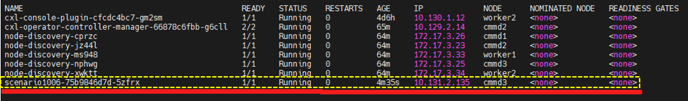      
